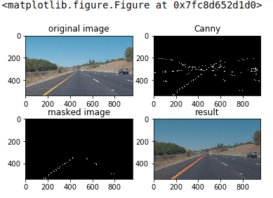

**Finding Lane Lines on the Road**

The goals / steps of this project are the following:
* Make a pipeline that finds lane lines on the road
* Reflect on your work in a written report  

---

## Reflection

### Describe your pipeline. As part of the description, explain how you modified the draw_lines() function.

My pipeline consisted of 6 steps.  
- First, I converted the image to grayscale;  
- Then I processed the gray image with gaussian_blur so that the pixels would be picked with different weight so that some noise would be filtered.  
- The blured image were processed by canny method to get edges  
- Region_of_interest was applied to keep only the region of the image defined by the polygon formed from `vertices`  
- Using hough_lines method to draw lines in the image  
- Weighted_img() would make adjustment to show a better result.

###  Identify potential shortcomings with your current pipeline

The code is not stable. It is only can work in good road condition.  
One potential shortcoming would be the masked region was set by fixed parameters, so if the road appears at a different rigion of one picture, the line may not be fully drawn or some other objects which were not lanes would generate lines.   

### Suggest possible improvements to your pipeline

A possible improvement would be to change draw line method, optimize it to average across all slope and intercepts; another impovement may be some kind of deep learning method.
